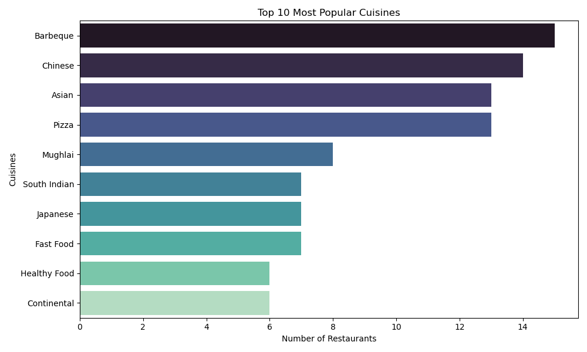
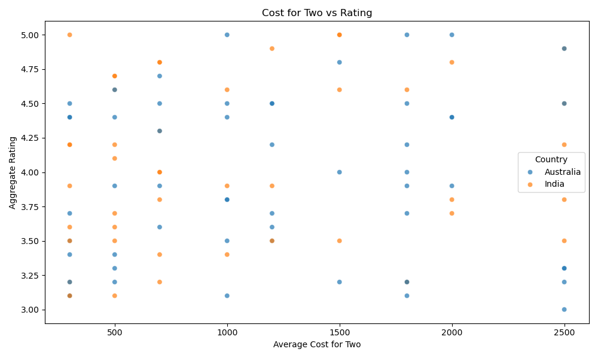
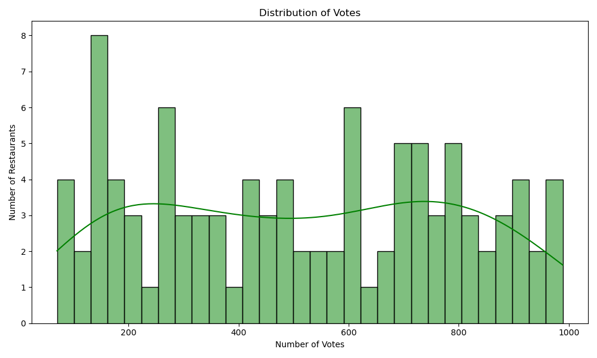
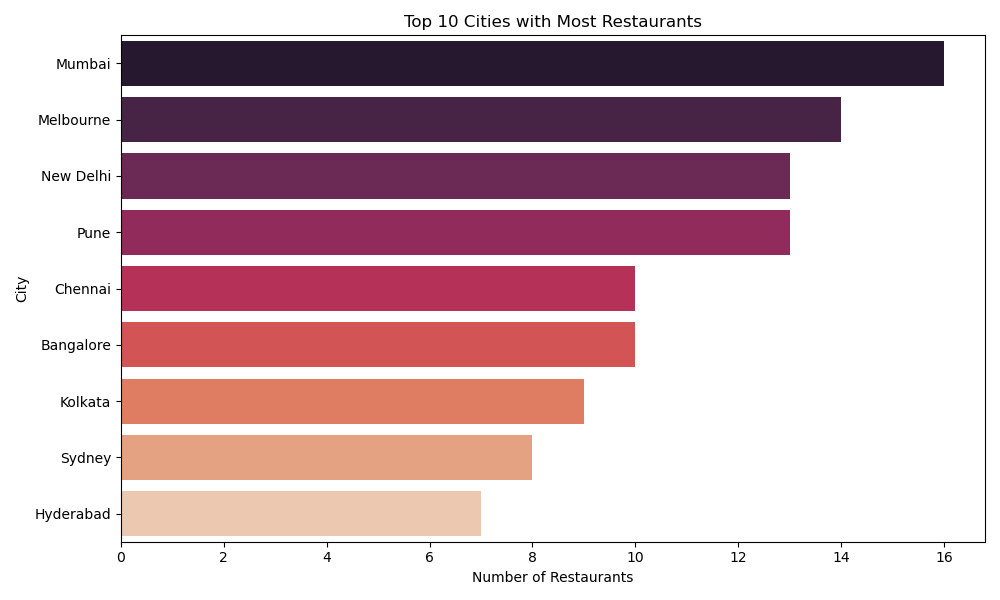
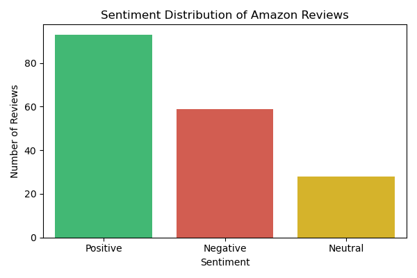

# 📊 CodeAlpha Data Analytics Internship Projects – Heman

This repository contains completed tasks from my **Data Analytics Internship at [CodeAlpha](https://www.codealpha.tech)**.  
Each project dives into real-world datasets to uncover insights using Python, Pandas, Matplotlib, Seaborn, and more.

---

## ✅ Completed Tasks

### 📈 Task 2: Exploratory Data Analysis – IPL 2023

This project focuses on **Exploratory Data Analysis (EDA)** on a sample IPL 2023 dataset to understand team performance, toss decisions, and player achievements.

---

#### 📁 Dataset Details
- File: `IPL_2023_Matches.csv`
- Contains: Match ID, Team1, Team2, Toss details, Winner, Player of the Match, etc.
- Type: Structured CSV mimicking IPL 2023 season patterns

---

#### 🔍 Key Insights
- Top winning teams of the season  
- Toss decision trends: fielding vs batting  
- Player of the Match frequency  
- Null value checks and structure overview

---

#### 🛠 Tools & Libraries Used
- Python 🐍  
- Pandas  
- Matplotlib  
- Seaborn  
- Jupyter Notebook

---

#### 📊 Visual Insights

##### 🏆 Top Winning Teams  

---

##### 🎯 Toss Decision Frequency  

---

##### 🌟 Player of the Match Frequency  

---

### 📊 Task 3: Data Visualization – Zomato Dataset

A data visualization project that explores restaurant data and customer behavior across countries and cities.

---

#### 📁 Dataset Details
- `zomato.csv` – Restaurant listings with cuisines, ratings, votes, and costs
- `Country-Code.xlsx` – Mapping file to get country names from codes

The datasets were merged on the `Country Code` column for enriched analysis.

---

#### 🧼 Preprocessing
- Removed missing values in important columns like `Cuisines`, `Aggregate rating`, and `Votes`
- Converted data to appropriate types for analysis
- Created custom groupings and aggregations for plots

---

#### 📈 Visualizations

##### 1️⃣ Top 10 Cuisines  
> Most loved food types across all restaurants  

---

##### 2️⃣ Average Rating by Country  
> Mean rating of restaurants in each country  

---

##### 3️⃣ Cost for Two vs Rating  
> Does cost reflect in higher ratings?  

---

##### 4️⃣ Votes Distribution  
> How actively users are voting  

---

##### 5️⃣ Top 10 Cities  
> Cities with the highest number of restaurant listings  

---

#### 📁 Output Folder Structure

Task-3_DataVisualization/
├── zomato.csv
├── Country-Code.xlsx
├── data_viz_zomato.ipynb
├── README.md
└── plots/
├── top_cuisines.png
├── avg_rating_by_country.png
├── cost_vs_rating.png
├── votes_distribution.png
└── top_10_cities.png

---

## 🧠 Skills Gained

- Exploratory Data Analysis (EDA)  
- Data Cleaning and Aggregation  
- Data Visualization and Storytelling  
- Handling Multi-source Datasets  
- Insightful Reporting for Business Contexts

---

## 🧑‍💻 Author

**Heman**  
Student HOD – CSE (Data Science), HITAM  
🔗 [LinkedIn](https://www.linkedin.com/in/your-profile)  
🐱 [GitHub](https://github.com/hemannayak)

---

## 📌 Project Repository

🔗 [CodeAlpha_DataAnalytics_Internship – GitHub Repo](https://github.com/hemannayak/CodeAlpha_DataAnalytics_Internship)

---

## 🏁 Status

✔️ Tasks Completed: 2 & 3  
📤 Uploaded and synced to GitHub  
🎥 Project walkthrough video (in progress)  

# 💬 Task 4: Sentiment Analysis – Amazon Reviews

This task is part of my **Data Analytics Internship at [CodeAlpha](https://www.codealpha.tech)** where I performed sentiment analysis on 200+ Amazon product reviews using Natural Language Processing (NLP) techniques.

---

## 📁 Dataset

- File: `amazon_reviews.csv`  
- Contains: Product reviews scraped from Amazon (manually curated)  
- Fields: Review Text

---

## 🛠 Tools & Libraries Used

- Python 🐍  
- Pandas  
- TextBlob (for sentiment polarity & subjectivity)  
- Matplotlib & Seaborn  
- Jupyter Notebook

---

## 🔍 Sentiment Process

1. Cleaned and preprocessed raw reviews  
2. Used `TextBlob` to classify each review as:
   - Positive 😄
   - Neutral 😐
   - Negative 😡
3. Counted sentiment distribution
4. Visualized it with Seaborn

---

## 📊 Visualization

### 📈 Sentiment Distribution

> Understanding the mood of customers through review data.

---

## 🏁 Outcome

This task helped me:
- Understand real-world sentiment data
- Use NLP tools like TextBlob
- Practice textual data cleaning and visualization

---

## 📌 Folder Structure

Task-4_SentimentAnalysis/
├── amazon_reviews.csv
├── sentiment_analysis.ipynb
├── README.md
└── plots/
└── sentiment_distribution.png

---

## ✅ Status

✔️ Completed  
📤 Uploaded to GitHub  
🎥 Video explanation pending
