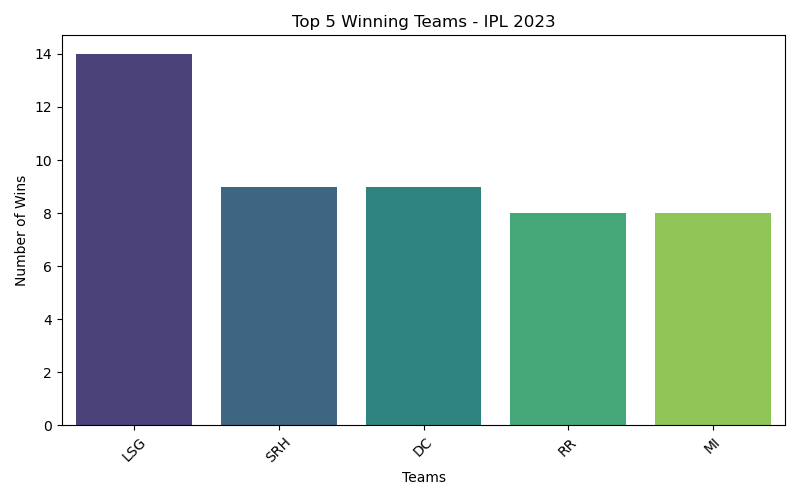
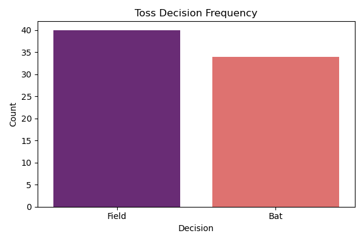
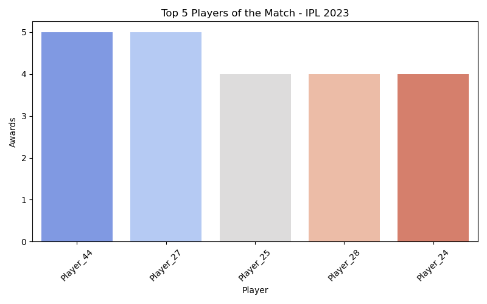

# 📈 Task 2: Exploratory Data Analysis on IPL 2023

This project is part of my **Data Analytics Internship at [CodeAlpha](https://www.codealpha.tech)**.  
Here, I performed **Exploratory Data Analysis (EDA)** on a sample IPL 2023 dataset to identify winning trends, player performance, and toss decisions using Python libraries like **Pandas, Matplotlib, and Seaborn**.

---

## 📁 Dataset

- File: `IPL_2023_Matches.csv`
- Type: Match-level structured CSV
- Contains: Match ID, Team1, Team2, Toss details, Winner, Player of the Match, etc.
- Source: Custom-created dataset based on IPL 2023 patterns

---

## 🔍 Key Analysis Performed

✅ Top winning teams  
✅ Toss decision patterns  
✅ Most frequent “Player of the Match” winners  
✅ Basic cleaning, null check, structure overview

---

## 🛠️ Tools & Libraries Used

- Python 🐍  
- Pandas  
- Matplotlib  
- Seaborn  
- Jupyter Notebook / Google Colab

---

## 📊 Visual Insights

### 🏆 Top Winning Teams

---

### 🎯 Toss Decision Frequency

---

### 🌟 Player of the Match Frequency

---

## 📽️ Project Walkthrough

I’ll post a short video explanation of this project on [LinkedIn](https://www.linkedin.com) along with my GitHub repo link.

---

## 🧑‍💻 Author

**Heman**  
Student HOD – CSE (Data Science), HITAM  
🔗 [LinkedIn](https://www.linkedin.com/in/your-profile)  
🐱 [GitHub](https://github.com/your-username)

---

## 📌 Submission Details

- Internship: **CodeAlpha – Data Analytics**
- Task: **2 of 4 — Exploratory Data Analysis (EDA)**
- Project Repo: `CodeAlpha_DataAnalytics_Internship`

---

## ✅ Status

✔️ Completed & Ready for Submission  
📤 Uploaded to GitHub  
🎥 Video Pending  
