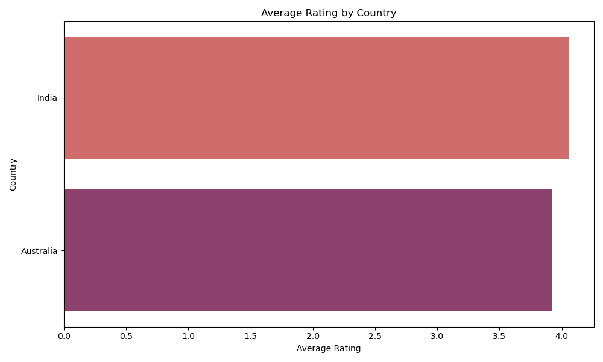

# 📈 Task 2: Exploratory Data Analysis on IPL 2023

This project is part of my **Data Analytics Internship at [CodeAlpha](https://www.codealpha.tech)**.  
Here, I performed **Exploratory Data Analysis (EDA)** on a sample IPL 2023 dataset to identify winning trends, player performance, and toss decisions using Python libraries like **Pandas, Matplotlib, and Seaborn**.

---

## 📁 Dataset

- File: `IPL_2023_Matches.csv`
- Type: Match-level structured CSV
- Contains: Match ID, Team1, Team2, Toss details, Winner, Player of the Match, etc.
- Source: Custom-created dataset based on IPL 2023 patterns

---

## 🔍 Key Analysis Performed

✅ Top winning teams  
✅ Toss decision patterns  
✅ Most frequent “Player of the Match” winners  
✅ Basic cleaning, null check, structure overview

---

## 🛠️ Tools & Libraries Used

- Python 🐍  
- Pandas  
- Matplotlib  
- Seaborn  
- Jupyter Notebook / Google Colab

---

## 📊 Visual Insights

### 🏆 Top Winning Teams

---

### 🎯 Toss Decision Frequency

---

### 🌟 Player of the Match Frequency

---

## 📽️ Project Walkthrough

I’ll post a short video explanation of this project on [LinkedIn](https://www.linkedin.com) along with my GitHub repo link.

---

## 🧑‍💻 Author

**Heman**  
Student HOD – CSE (Data Science), HITAM  
🔗 [LinkedIn](https://www.linkedin.com/in/your-profile)  
🐱 [GitHub](https://github.com/your-username)

---

## 📌 Submission Details

- Internship: **CodeAlpha – Data Analytics**
- Task: **2 of 4 — Exploratory Data Analysis (EDA)**
- Project Repo: `CodeAlpha_DataAnalytics_Internship`

---

## ✅ Status

✔️ Completed & Ready for Submission  
📤 Uploaded to GitHub  
🎥 Video Pending  
=======

# 📊 Task 3: Data Visualization – Zomato Dataset

This task is part of my **Data Analytics Internship at CodeAlpha**, where I performed data visualization on a restaurant dataset to uncover trends in cuisines, ratings, and customer preferences.

---

## 📁 Dataset Details
- **`zomato.csv`** – Restaurant listings with details like cost, votes, and cuisines.
- **`Country-Code.xlsx`** – Mapping of country codes to country names.

Merged both datasets using `Country Code` to enrich our data with country names 🌍

---

## 🛠 Tools & Libraries
- Python 🐍  
- Pandas 📊  
- Matplotlib & Seaborn 🎨 
- Jupyter Notebook 🧠

---

## 🧼 Preprocessing Steps
- Removed missing values in `Cuisines`, `Aggregate rating`, and `Votes`.
- Converted columns to appropriate numeric types.
- Grouped and aggregated data for storytelling.

---

## 📈 Visualizations Created

### 1️⃣ Top 10 Cuisines  
> Most popular cuisines across all listed restaurants.

---

### 2️⃣ Average Rating by Country  
> Ranking countries based on average restaurant ratings.

---

### 3️⃣ Cost for Two vs Rating  
> Scatterplot to check if cost impacts ratings.

---

### 4️⃣ Votes Distribution  
> Histogram showing user engagement through votes.

---

### 5️⃣ Top 10 Cities  
> Cities with the most restaurant listings in the dataset.

---

## 📸 Output Folder Structure

Task-3_DataVisualization/
├── zomato.csv
├── Country-Code.xlsx
├── data_viz_zomato.ipynb
├── README.md
└── plots/
├── top_cuisines.png
├── avg_rating_by_country.png
├── cost_vs_rating.png
├── votes_distribution.png
└── top_10_cities.png

---

## 🏁 Outcome

This task helped strengthen my skills in:
- 📊 Data visualization
- 🕵️ Exploratory data analysis (EDA)
- 📢 Communicating insights clearly through visuals

Proud to complete this as part of my internship journey at **CodeAlpha** ✨

---

## 📌 Repo Link:
[🔗 GitHub Repo – CodeAlpha Data Analytics Internship](https://github.com/hemannayak/CodeAlpha_DataAnalytics_Internship)

